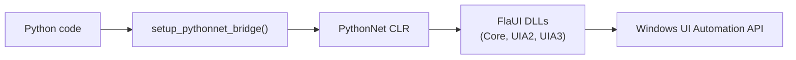

# Advanced

Deep dive into element methods, XPath, TreeWalker, caching, retries, and interop patterns.

## Element methods by type

Each page in the [API Reference](api/index.md) lists all methods. Highlights below (element-specific counts for discovery; pages show all methods including inherited ones).

- **Button**: `click`, `invoke`, `right_click`, `double_click`
- **CheckBox**: `toggle`, `toggle_state`
- **RadioButton**: `select`, `is_selected`
- **ComboBox / ComboBoxItem**: `select(value|index)`, `items`, `expand`/`collapse`
- **TextBox**: `enter`, `append_text`, `clear`, `select_all`, `text`
- **ListBox / ListBoxItem**: `select(index|name)`, `items`
- **Slider**: `set_value`, `value`, `minimum`, `maximum`
- **Spinner**: `increment`, `decrement`, `value`
- **Tab / TabItem**: `select_tab_item`, `selected_tab`
- **Tree / TreeItem**: `expand`, `collapse`, `children`, `select`
- **Grid / DataGridView / Table**: `rows`, `cells`, `headers`, `select_cell`
- **Window**: `close`, `pattern` accessors, `modal_dialogs`
- **Menu / MenuItem**: `items`, `invoke`

## Finding Elements

FlaUI provides multiple strategies for finding elements. The most common are `ConditionFactory` (fast, specific) and `XPath` (flexible, structured).

### TreeScope

When searching, you define the "Scope" of the search:

- **Element**: The element itself.
- **Children**: Direct children only (1 level down).
- **Descendants**: All children, grandchildren, etc. (Full subtree).
- **Subtree**: The element + All Descendants.
- **Ancestors**: Parents, grandparents, up to root.

*Note: Descendant searches can be slow on large trees. Prefer Children or `TreeWalker` if you know the path.*

### Reference: ConditionFactory vs XPath

| Feature | ConditionFactory | XPath |
| --- | --- | --- |
| **Speed** | Very Fast (Native UIA) | Slower (Parses tree) |
| **Stability** | High (IDs, Types) | High (if using IDs) |
| **Complexity** | Verbose for deep nested logic | Concise for relations (`//List/Button`) |
| **Usage** | Default recommendation | Complex tree traversal |

## XPath reference

From [FlaUI](https://github.com/FlaUI/FlaUI) C# UITests (hardcoded for accuracy):

=== "Python"

    ```python
    ok = window.find_first_by_x_path("//Button[@Name='OK']")
    items = window.find_all_by_x_path("//ListItem")
    menu = window.find_first_by_x_path("/MenuBar/MenuItem[@Name='File']")
    ```

=== "C#"

    ```csharp
    var element = window.FindFirstByXPath("//Button[@Name='OK']");
    var items = window.FindAllByXPath("//ListItem");
    var menu = window.FindFirstByXPath("/MenuBar/MenuItem[@Name='File']");
    ```

## ConditionFactory (Advanced)

While `basics.md` covers simple lookups, you can combine conditions for precise targeting using chaining.

### Chaining Conditions (AND/OR/NOT)

You can chain conditions using `.And()`, `.Or()`, and `.Not()` methods on the condition objects.

=== "Python"

    ```python
    cf = main_window.condition_factory

    # AND: Find a Button named "Submit"
    # Matches: (ControlType == Button) AND (Name == "Submit")
    submit_btn = cf.by_control_type(ControlType.Button).And(cf.by_name("Submit"))

    # OR: Find element with ID "btn1" OR "btn2"
    # Matches: (AutomationId == "btn1") OR (AutomationId == "btn2")
    any_btn = cf.by_automation_id("btn1").Or(cf.by_automation_id("btn2"))

    # NOT: Find buttons that are NOT disabled
    # Matches: (ControlType == Button) AND NOT (IsEnabled == False)
    # Note: Use PropertyCondition for raw properties
    enabled_btns = cf.by_control_type(ControlType.Button).And(
        cf.by_property("IsEnabled", False).Not()
    )
    ```

=== "C#"

    ```csharp
    var cf = automation.ConditionFactory;

    // AND
    var submitBtn = cf.ByControlType(ControlType.Button).And(cf.ByName("Submit"));

    // OR
    var anyBtn = cf.ByAutomationId("btn1").Or(cf.ByAutomationId("btn2"));
    ```

### Property-based conditions

```python
# By any property
enabled_checkbox = main_window.find_first_descendant(
    cf.by_property("IsEnabled", True)
)

# By help text
help_element = main_window.find_first_descendant(
    cf.by_help_text("Enter your username")
)

# By framework (WinForms, WPF, etc.)
wpf_elements = main_window.find_all_descendants(
    cf.by_framework_id("WPF")
)
```

**Best practices:**

- Use `by_automation_id()` for stable, reliable locators
- Combine conditions to narrow searches: `and_condition(by_control_type(...), by_name(...))`
- ConditionFactory is faster than XPath for simple queries
- Cache condition objects when reusing the same search multiple times

## TreeWalker traversal

```python
walker = automation.get_tree_walker()
root = walker.get_first_child(main_window)
while root:
    # inspect or act on root
    root = walker.get_next_sibling(root)
```

Use TreeWalker for performance when you already know relative structure.

## CacheRequest (performance)

```python
from flaui.core.cache_request import CacheRequest
from flaui.core.definitions import TreeScope

with CacheRequest(TreeScope.Descendants, patterns=["Invoke"], properties=["Name"]):
    cached = main_window.find_first_descendant(cf.by_control_type(ControlType.Button))
    cached.invoke()
```

Cache when traversing large trees repeatedly. Disable when interacting with live-updating UI.

## Retry / polling

```python
from flaui.core.tools import Retry
submit = Retry.While(
    lambda: main_window.find_first_descendant(cf.by_name("Submit")),
    timeout=5000,
    interval=100,
)
submit.as_button().invoke()
```

Use Retry for slow-loading dialogs or async content. Prefer shorter intervals with modest timeouts.

## post_wait on input

Most Mouse/Keyboard operations accept `post_wait` (bool|float|callable) to wait after the action. Examples:

```python
from flaui.core.input import Mouse, Keyboard
point = button.get_clickable_point()
Mouse.click(point, post_wait=True)
Keyboard.type("Hello", post_wait=0.25)
```

## Exception translation (@handle_csharp_exceptions)

Decorate interop methods to map C# exceptions to Python ones automatically. All public element methods follow this pattern—mirror it in new additions.

## Late imports (avoid circular deps)

Import C# types inside methods when needed:
```python
def as_button(self):
    from FlaUI.Core.AutomationElements import Button as CSButton
    return Button(raw_element=CSButton(self.framework_automation_element))
```

## Object mapping pattern (page objects)

From `tests/test_utilities` (WinForms/WPF maps):
```python
class SimpleControlsElements(BaseSettings):
    main_window: Window

    @property
    def invoke_button(self) -> Button:
        return self.main_window.find_first_descendant(
            self._cf.by_automation_id("InvokeButton")
        ).as_button()
```

Use Pydantic models to compose reusable element accessors that mirror your app structure.

## Deeper inspection tools

- FlaUIInspect: best for pattern/property exploration (bundled with FlaUI)
- Accessibility Insights: quick property lookup and contrast/automation checks

## PythonNet bridge flow



## When to use what

- **XPath**: sibling/ancestor relationships, dynamic lists
- **ConditionFactory**: fast, stable IDs and control types
- **TreeWalker**: performant traversal when structure is known
- **CacheRequest**: repeated reads on static trees
- **Retry**: slow UI, dialogs, async operations
