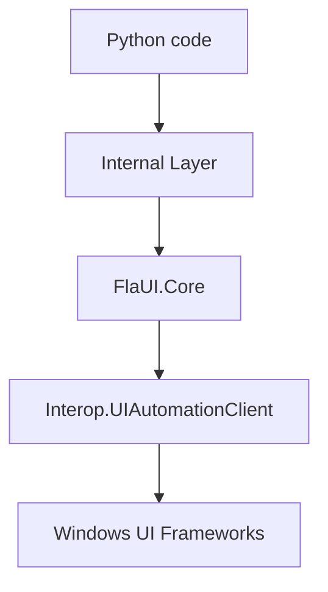
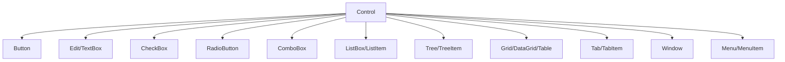

# Concepts

Understand the platforms, patterns, and limitations before scaling your suites.

## UIA2 vs UIA3

Windows UI Automation comes in two flavors:

| Aspect | UIA2 (Managed) | UIA3 (COM) |
| --- | --- | --- |
| **Technology** | Managed .NET API | Native COM API |
| **Best for** | Legacy WinForms, older apps | WPF, UWP, Store Apps, WinUI 3 |
| **Patterns** | Limited set (no Text2/Transform2) | Full modern pattern set |
| **Performance** | Lower memory, faster on detailed trees | Better at virtualization |
| **Stability** | Very stable on WinForms | Robust on modern apps; quirks on old WinForms |

**Guidance:**
Start with **UIA3** for modern applications. If you encounter missing elements or instability in legacy applications, try switching to **UIA2**.

## Architecture

FlaUI interacts internally with the Microsoft UI Automation API through a robust .NET layer.

## AutomationElement

At the core of FlaUI is the `AutomationElement`. Every button, window, or label you interact with is an `AutomationElement`.

- **Wrapper**: It wraps the raw COM object from Windows.
- **Type Conversions**: You can "cast" it to specific types like `.as_button()` or `.as_text_box()` to get helper methods.
- **Properties**: Access standard UIA properties like `automation_id`, `name`, `control_type`, `is_enabled`, etc.

## ControlType Hierarchy

A simplified view of how controls relate:

## Patterns

User Interface Automation (UIA) uses "Patterns" to define behavior. Instead of knowing *what* a control is (e.g., a "FancyButton"), UIA cares *what it can do* (it can be Invoked).

| Pattern | Description | Used By |
| --- | --- | --- |
| **Invoke** | Action-oriented triggering (stateless) | `Button`, `MenuItem`, `Hyperlink` |
| **Toggle** | cycle through states (On/Off/Indeterminate) | `CheckBox`, `ToggleButton` |
| **Selection** | Managing a container of items | `ListBox`, `ComboBox`, `Tab` |
| **SelectionItem** | An individual selectable item | `ListBoxItem`, `TabItem` |
| **Value** | Setting/getting a string value | `TextBox`, `ComboBox` (editable) |
| **RangeValue** | Setting a value within a range | `Slider`, `ScrollBar`, `ProgressBar` |
| **ExpandCollapse** | Showing/hiding content | `ComboBox`, `TreeItem`, `MenuItem` |
| **Window** | distinct window operations | `Window` (Close, Minimize, Maximize) |

**Why does this matter?**
Sometimes a custom control might look like a button but implements the `TogglePattern` instead of `InvokePattern`. Using tools like **FlaUIInspect** helps you see exactly which patterns a control supports.

## Known Limitations

- **Store Apps**: Windows 11 Notepad is a Store app; use UIA3.
- **Missing Patterns**: UIA2 lacks `Text2Pattern` and `Transform2Pattern`.
- **Virtualization**: Large lists (Grid/ListBox) may not load elements until scrolled into view. Use `ScrollPattern` to reveal them first.
