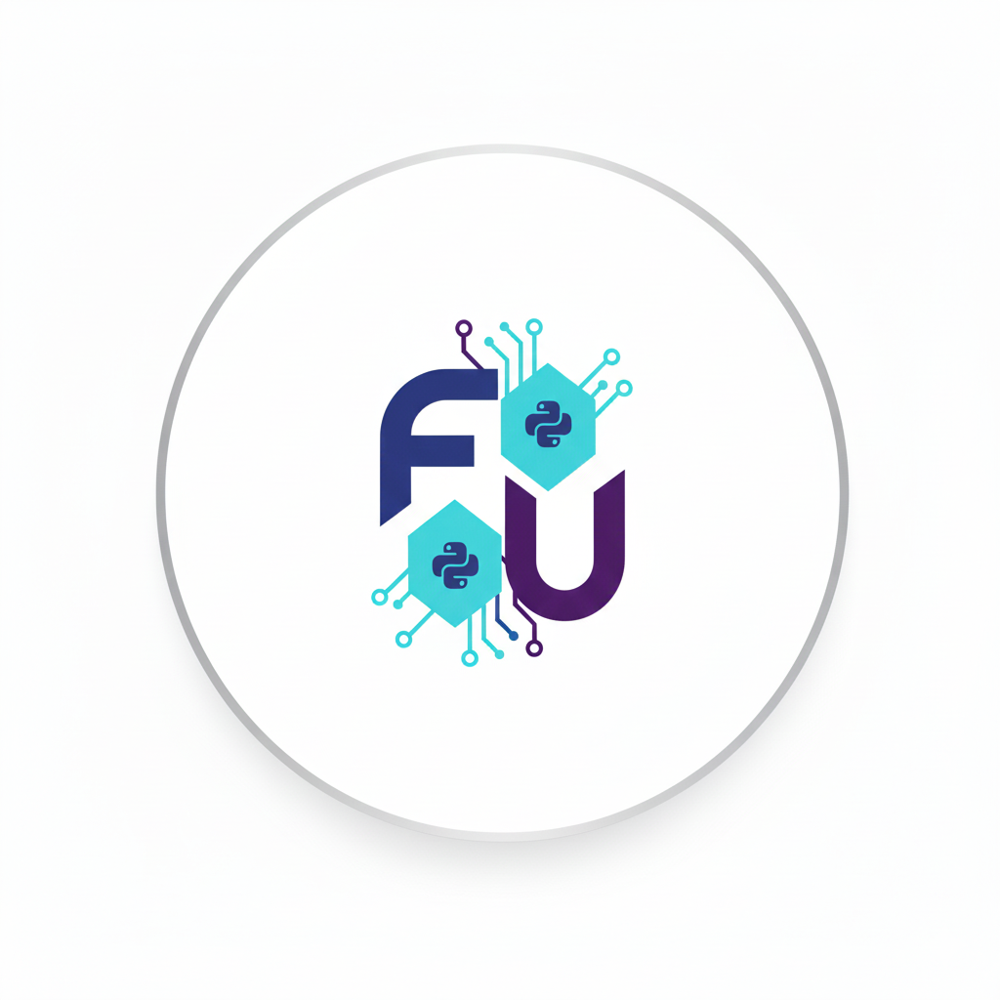

# FlaUI for Python

> The complete FlaUI Windows UI Automation API — made Pythonic, typed, and batteries-included.



<p class="hero-badges" markdown>
[](https://pypi.org/project/flaui-uiautomation-wrapper/)
[](https://pypi.org/project/flaui-uiautomation-wrapper/)
[](https://github.com/amruthvvkp/flaui-uiautomation-wrapper/blob/master/LICENSE)
[](https://github.com/amruthvvkp/flaui-uiautomation-wrapper)
</p>

Automate any Windows application — WinForms, WPF, Win32, or Store apps — from Python with a clean,
fully typed API that maps **1:1** to the battle-tested [FlaUI](https://github.com/FlaUI/FlaUI) C#
library. No driver binaries to manage, no framework lock-in.

[Get started](basics.md){ .md-button .md-button--primary }
[API Reference](api/index.md){ .md-button }
[Why FlaUI for Python?](motivation.md){ .md-button }

## Installation

FlaUI for Python targets **Python 3.10–3.14** on **Windows** (the bundled FlaUI DLLs require the
Windows UI Automation stack). All C# dependencies ship inside the wheel — there are no external
drivers to install.

=== "pip"

    ```bash
    pip install flaui-uiautomation-wrapper
    ```

=== "uv"

    ```bash
    uv add flaui-uiautomation-wrapper
    ```

### Trying a beta

We publish `1.0.0bN` betas on the road to v1.0. Pre-releases are **not** installed by default —
opt in explicitly:

=== "pip"

    ```bash
    pip install --pre --upgrade flaui-uiautomation-wrapper
    # or pin an exact beta for reproducibility
    pip install flaui-uiautomation-wrapper==1.0.0b1
    ```

=== "uv"

    ```bash
    uv pip install --prerelease=allow flaui-uiautomation-wrapper
    ```

See [Road to v1.0](release-plan.md) for the beta-soak plan and how to give feedback.

## Get Started

!!! note "Why the C# examples?"

    Upstream [FlaUI](https://github.com/FlaUI/FlaUI) has limited written documentation, so
    throughout these docs we pair each Python snippet with the **equivalent C# code** for
    reference. If you have seen a pattern in the original C# library, the side-by-side tabs make
    it easy to map it onto the Python API.

=== "Python"

    ```python
    # Standard initialization
    from flaui.lib.pythonnet_bridge import setup_pythonnet_bridge
    setup_pythonnet_bridge()

    from flaui.modules.automation import Automation
    from flaui.lib.enums import UIAutomationTypes

    automation = Automation(UIAutomationTypes.UIA3)
    main_window = automation.application.launch("notepad.exe").get_main_window(automation)
    main_window.find_first_by_x_path("//Button[@Name='OK']").as_button().invoke()
    ```

=== "C#"

    ```csharp
    using FlaUI.UIA3;
    using FlaUI.Core;

    var automation = new UIA3Automation();
    var app = Application.Launch("notepad.exe");
    var mainWindow = app.GetMainWindow(automation);
    mainWindow.FindFirstByXPath("//Button[@Name='OK']").AsButton().Invoke();
    ```

## Why FlaUI for Python?

<div class="grid cards" markdown>

-   :material-microsoft-windows:{ .lg .middle } __Native UI Automation__

    ---

    Built on Microsoft's UI Automation (UIA) so you can inspect and drive any Windows
    application — WinForms, WPF, Win32, and Store apps alike.

-   :material-shield-check:{ .lg .middle } __Modern & Typed__

    ---

    Every element, pattern, and coordinate is backed by **Pydantic** — giving you
    autocompletion, IDE intellisense, and validation before calls cross the interop boundary.

-   :material-battery-charging:{ .lg .middle } __Batteries Included__

    ---

    Zero-configuration setup. All FlaUI DLLs are bundled in the wheel — no driver binaries or
    external runtimes to manage.

-   :material-swap-horizontal:{ .lg .middle } __Dual-Backend Support__

    ---

    Switch seamlessly between **UIA3** (COM-based, for modern apps) and **UIA2** (managed, for
    legacy apps) with a single argument.

-   :material-magnify:{ .lg .middle } __Advanced Element Search__

    ---

    Find elements by Accessibility ID, Name, XPath, or arbitrary `ConditionFactory` logic — plus
    a full set of UIA patterns (Toggle, Select, Expand, Scroll, …).

-   :material-shield-refresh:{ .lg .middle } __Resilient & Debuggable__

    ---

    Built-in `Retry`, dynamic timeouts, and input waiting keep tests stable; on-screen overlays,
    capture, and video recording make failures easy to diagnose.

</div>

## Works with any test framework

No lock-in to a single runner. Use FlaUI for Python with **pytest**, **unittest**,
**Robot Framework**, **Behave**, **TestPlan**, or your own harness — see the
[Examples](examples/pytest.md).

## Bundled Library Versions

--8<-- "docs/_includes/flaui_versions.md"

## Inspirations & Credits

- **[FlaUI](https://github.com/FlaUI/FlaUI)**: The core logic and test applications are derived from the upstream C# project.
- **[robotframework-flaui](https://github.com/GDATASoftwareAG/robotframework-flaui)** (GDATA): The prior-art Python integration for FlaUI that influenced this project's direction.
- **[Python.NET](https://github.com/pythonnet/pythonnet)**: The interop bridge that makes calling FlaUI from Python possible.
- **[Playwright](https://playwright.dev/python/) / [`pytest-playwright`](https://github.com/microsoft/playwright-pytest)** and **[FlaUIRecorder](https://github.com/twenzel/FlaUIRecorder)**: Inspirations for the planned recorder and pytest tooling.
- **Community**: Special thanks to the contributors of FlaUI and the Python.NET team.

## Next Steps

- **[Basics](basics.md)**: Learn the core workflow: Initialize → Launch → Find → Interact.
- **[Advanced Concepts](advanced.md)**: Master XPath, ConditionFactory, and Caching.
- **[API Reference](api/index.md)**: Explore the full method documentation for every control.
- **[Troubleshooting](troubleshooting.md)**: Resolve common setup and finding issues.
- **[Road to v1.0](release-plan.md)**: See how the project gets to a stable `v1.0.0`, how to test betas, and how docs are versioned.
