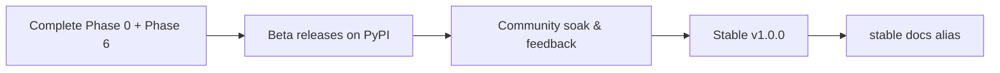

# Road to v1.0

This page explains how FlaUI for Python gets from where it is today to a **stable `v1.0.0`** on
PyPI, how you can help by testing **beta releases**, and how the documentation is **versioned** so
the docs you read always match the package you installed.

For the feature-level checklist see the [Roadmap](roadmap.md); this page is about *releasing*.

## Why a fresh 1.0

The last published release on PyPI is several years old and was a **thin, experimental layer**. The
current codebase is effectively a ground-up rewrite: Pydantic-backed models, a 1:1 FlaUI surface
(elements, patterns, events, capturing), UIA2/UIA3 facades, and a typed, Pythonic API. Because of
that, **0.x and 1.x are not API-compatible** — see the [Upgrade guide](upgrade-guide.md) before
migrating.

## Release stages



1. **Finish the intended scope** — close out [Phase 0 — Stabilize](roadmap.md#in-progress) (green
   CI + coverage gate) and the [Phase 6 enhancers](roadmap.md#in-progress) (context managers,
   collections, `expect()`, `py.typed` + `ty`).
2. **Publish betas to PyPI** — cut `1.0.0bN` pre-releases so users can try the new API on real
   apps without it becoming the default `pip install`.
3. **Soak & gather feedback** — triage issues against the [v1.0 milestones](roadmap.md#status-at-a-glance);
   iterate on betas as needed.
4. **Promote to stable `v1.0.0`** — once the betas are clean, publish the stable release and make
   `stable` the default documentation version.

## Testing a beta release

Pre-releases are **not** installed by default. Opt in explicitly:

=== "uv"

    ```bash
    uv pip install --prerelease=allow flaui-uiautomation-wrapper
    ```

=== "pip"

    ```bash
    pip install --pre --upgrade flaui-uiautomation-wrapper
    ```

Pin an exact beta when you want reproducibility:

```bash
pip install flaui-uiautomation-wrapper==1.0.0b1
```

Please report anything surprising on the
[issue tracker](https://github.com/amruthvvkp/flaui-uiautomation-wrapper/issues) — beta feedback is
the whole point of this stage.

## How releases are automated

Releases are **tag-driven**, which sidesteps the protected-`master` problem (no workflow needs to
push commits to `master`):

| Event | What happens | Where |
|-------|--------------|-------|
| **Pull request** | A dev build `1.0.0.dev<buildId>` is published to **TestPyPI** so reviewers can install the candidate. | Azure `deploy_testpypi` |
| **Merge to `master`** | The `release-beta` GitHub Action mints the next `1.0.0bN`, publishes a GitHub **pre-release** with notes drafted by [release-drafter](https://github.com/release-drafter/release-drafter) from the merged PRs, and pushes tag `v1.0.0bN`. | `.github/workflows/release-beta.yml` |
| **Tag `v1.0.0bN` pushed** | Azure builds the wheel/sdist and uploads to **PyPI**. PyPI auto-classifies it as a pre-release (only `--pre` installs it). | Azure `deploy_pypi` |
| **Tag `v1.0.0` pushed** (manual) | Same path publishes the **stable** release; docs `stable` alias becomes default. | Azure `deploy_pypi` + `deploy_docs` |

Each GitHub release links back to its PyPI version and the docs site (see `.github/release-drafter.yml`).

!!! note "Enabling the automation"
    Everything is **off by default** so nothing publishes until tokens are configured:

    - Azure: set `PUBLISH_TEST_PYPI` / `PUBLISH_PYPI` to `true` and configure the
      `TEST_PYPI_API_TOKEN` / `PYPI_API_TOKEN` secret pipeline variables.
    - GitHub: set the repository variable `ENABLE_BETA_RELEASES` to `true`
      (Settings → Secrets and variables → Actions → Variables).

## Documentation versioning

The docs site is **versioned** so that each release has its own snapshot. Versioning uses
[mike](https://github.com/squidfunk/mike) (Zensical's fork) and is enabled in `zensical.toml`:

```toml
[project.extra.version]
provider = "mike"
alias = true
```

Versions are published as subdirectories of the site, with two moving aliases:

| Alias | Points at | URL |
|-------|-----------|-----|
| `latest` | docs built from `master` (in-development) | `…/latest/` |
| `stable` | the most recent released version | `…/stable/` |

Until `v1.0.0` ships, **`latest` is the default** landing version. When `1.0.0` is released,
`stable` is set as the default so first-time visitors see released docs.

### Maintainer workflow

!!! note "mike installs from GitHub, not PyPI"
    ```bash
    pip install git+https://github.com/squidfunk/mike.git
    ```

Build the static site, then deploy it under a version + alias (run from the repo root):

```bash
# Build the current docs
uv run python scripts/extract_versions.py
uv run zensical build -f zensical.toml

# Deploy in-development docs as the `latest` alias
mike deploy --push --update-aliases dev latest

# On a release, deploy the version and move the `stable` alias
mike deploy --push --update-aliases 1.0.0 stable

# At v1.0.0, make `stable` the landing version
mike set-default --push stable
```

Each `mike deploy` commits to the `gh-pages` branch; `--push` publishes immediately.

### Automated deployment (CI)

The Azure Pipelines `deploy_docs` stage publishes versioned docs with mike automatically:

| Trigger | Published version | Alias | Default? |
|---------|-------------------|-------|----------|
| Push to `master` | `dev` | `latest` | no |
| Tag `vX.Y.Z` | `X.Y.Z` | `stable` | yes (`mike set-default`) |

!!! note "Enabling the deploy"
    The stage is gated behind the `PUBLISH_DOCS` pipeline variable (currently `false`) and a
    `GITHUB_PAGES_TOKEN` secret. Flip `PUBLISH_DOCS` to `true` once a first manual `mike deploy`
    has seeded the `gh-pages` branch and you've confirmed the version selector renders.
